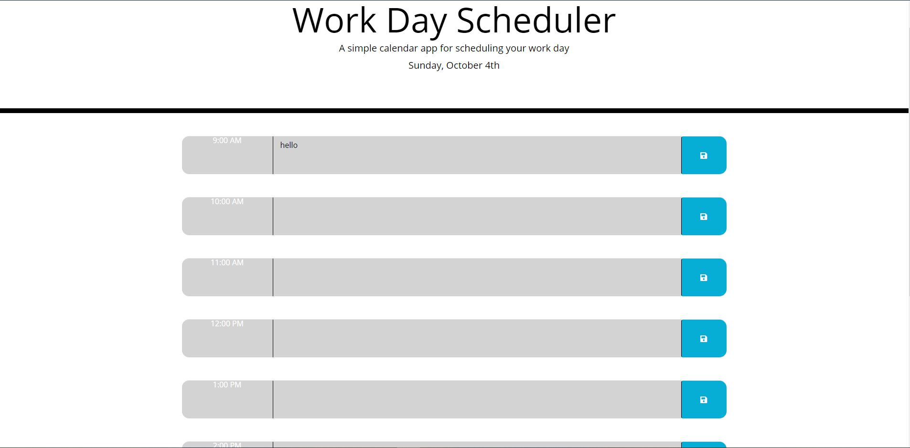

# Work Day Scheduler Starter Code

## Completed Objectives
* Date is displayed when schedule is opened
* Time blocks are displayed
* time blocks are color coded accoriding to the time
* When you click on time block you can add an event
* Event is saved after pressing the save button
* Everything is saved even after refreshing

## Technology Used
* HTML
* CSS
* Javascript
* JQuery
* Bootstrap
* Moment.js

## Website Acces
